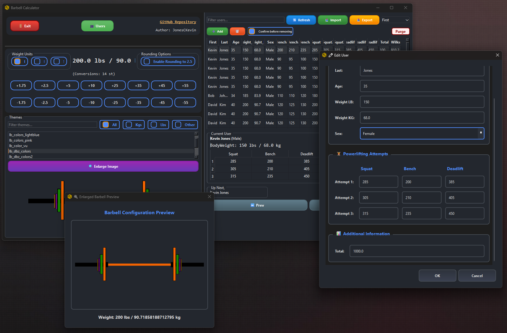

# Python GUI - Barbell Calculator

<div style="border: 10px solid rgb(14, 202, 68); 
border-radius: 0 35px 0 35px; 
box-shadow: 5px 5px 15px rgba(0, 0, 0, 0.5); display: inline-block;">
    
</div>

## Overview

The **Barbell Calculator** is a visual aid for weightlifting enthusiasts. It helps calculate barbell weights and provides a customizable theme interface.

## Features

- Calculate barbell weights in pounds, kilograms, and stones.
- Enable rounding for precise weight adjustments.
- Create or Choose from multiple themes for a personalized experience.
- Interactive UI with weight adjustment buttons.

### Creating your own theme
1. Create a new theme folder in the `BarBellWeights` directory. The name should start with `lb_` or `kg_` to indicate the weight type. Otherwise, the theme will go to the All/Other filter.
2. Copy one of the examples for quicker results, but ensure you have a `bar.png`, `none.png`, and the files should be named by their weight type (e.g., `45.png`, `47.5.png`).
3. I recommend putting weights from `45 to 855 for barbell` or `5 to 120 for dumbbell`. 
4. If you want to add your theme or make changes, just create a pull request.

## Preperations / Installation


Installs `python` and `pip` along with all required packages and dependencies. 

### Using Bash (Linux/MacOS)
```bash
bash Setup.sh
```

### Using PowerShell (Windows)
```powershell
.\Setup.ps1
```

## Webapp Usage

1. Run the application:
   ```bash
   python web_app.py
   ```
2. Open your browser and navigate to `http://127.0.0.1:5000`.

## Configuration File

The application uses a `config.yaml` file located in the `resources` directory. You can customize:
- Window dimensions
- Fonts and colors
- Barbell types and weights
- Theme paths

## Ideas

- Add hot key bindings for quick access to common functions for custom button setups such as a small 10 button keyboard that will add or remove weights.
- Add a hotkey mapping config file and allow users to use the gui to map on the fly.
- Add Gui customizations
- Add a feature to save and load user profiles with custom settings.
- Implement a dark mode theme option for better visibility.

## Author

Created by **JonesCKevin**.  
GitHub Repository: [Bar_loader_Colored](https://github.com/Jonesckevin/Bar_loader_Colored)
